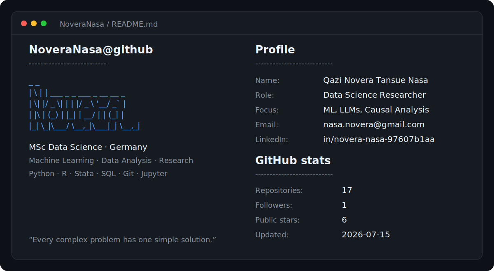

<picture>
  <source media="(prefers-color-scheme: dark)" srcset="./dark_mode.svg">
  <source media="(prefers-color-scheme: light)" srcset="./light_mode.svg">
  
</picture>

## Selected projects

- [EURO_CUP24](https://github.com/NoveraNasa/EURO_CUP24) — football analytics and match-outcome prediction
- [HRDataAnalysis](https://github.com/NoveraNasa/HRDataAnalysis) — human-resources data analysis
- [Kidney-Diseases](https://github.com/NoveraNasa/Kidney-Diseases) — end-to-end deep-learning project
- [childEpiDataR](https://github.com/NoveraNasa/childEpiDataR) — epidemiological and child-health analysis in R
- [creaditworthiness](https://github.com/NoveraNasa/creaditworthiness) — machine-learning creditworthiness project

## Current focus

Machine learning, data analysis, generative AI, large language models, deep learning, econometrics, and reproducible research.
